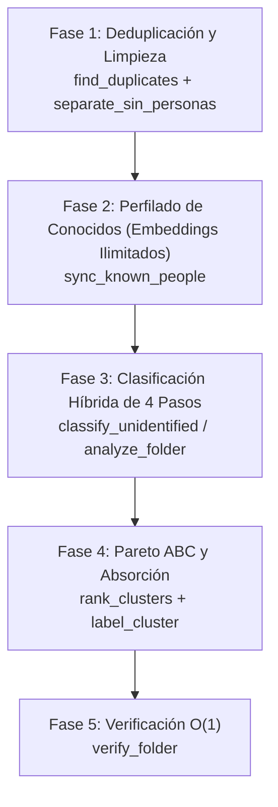

# PhotOrganizer (Photo & Video Organization Skill)

Skill especializada en gobernar y orquestar el servidor MCP `photo-organizer` para clasificar grandes colecciones de imágenes y videos locales mediante biometría facial (InsightFace buffalo_l), detección corporal (YOLOv8), clustering DBSCAN, deduplicación perceptual y auditoría O(1) de manifiestos.

---

## Flujo de Trabajo Metodológico en 5 Fases

Cualquier operación integral de organización debe seguir rigurosamente este pipeline de 5 fases:



### Fase 1: Inventario y Deduplicación
1. Identificar y aislar fotos idénticas (SHA-256) o recomprimidas (dHash) para liberar espacio y evitar cómputo neuronal redundante:
   ```json
   // Herramienta MCP: find_duplicates
   {
     "folder_path": "C:\\temp\\0rganizar\\_Sin_Identificar",
     "threshold": 2,
     "action": "isolate"
   }
   ```
2. Separar imágenes sin presencia humana (paisajes, objetos, capturas) mediante detector YOLOv8:
   ```json
   // Herramienta MCP: separate_sin_personas
   {
     "source_folder": "C:\\temp\\0rganizar\\_Sin_Identificar"
   }
   ```

### Fase 2: Perfilado de Personas Conocidas (Embeddings Ilimitados)
Sincronizar y recalcular vectores faciales de referencia en las carpetas base de personas. **Los embeddings son ilimitados** para capturar la máxima variación de edad, expresiones, poses y condiciones de iluminación:
```json
// Herramienta MCP: sync_known_people
{
  "base_dir": "C:\\temp\\0rganizar"
}
```

### Fase 3: Clasificación Híbrida
Clasificar lotes de imágenes desconocidas contra la base de personas conocidas aplicando la secuencia canónica de 4 pasos:
```json
// Herramienta MCP: classify_unidentified
{
  "unidentified_folder": "C:\\temp\\0rganizar\\_Sin_Identificar",
  "threshold": 0.40
}
```
Para carpetas no estructuradas que requieran clustering DBSCAN nuevo:
```json
// Herramienta MCP: analyze_folder
{
  "folder_path": "C:\\temp\\0rganizar",
  "action": "move"
}
```

### Fase 4: Priorización Pareto ABC y Absorción
1. Clasificar cuantitativamente los clusters generados para enfocar el esfuerzo en el 80% de volumen:
   ```json
   // Herramienta MCP: rank_clusters
   {
     "base_dir": "C:\\temp\\0rganizar",
     "top_n": 10
   }
   ```
2. Inspeccionar fotos de clusters prioritarios de Tier A con paginación compacta:
   ```json
   // Herramienta MCP: get_cluster_photos
   {
     "db_path": "C:\\temp\\0rganizar\\.photo_organizer.db",
     "cluster_id": "0_cluster",
     "page": 1,
     "page_size": 20
   }
   ```
3. Asignar nombre formal al cluster para retroalimentar la base de personas conocidas:
   ```json
   // Herramienta MCP: label_cluster
   {
     "db_path": "C:\\temp\\0rganizar\\.photo_organizer.db",
     "cluster_id": "0_cluster",
     "name": "Maria Lopez"
   }
   ```

### Fase 5: Verificación O(1) de Integridad
Auditar la consistencia física contra los encabezados de manifiesto en milisegundos:
```json
// Herramienta MCP: verify_folder
{
  "folder_path": "C:\\temp\\0rganizar",
  "check_all_subfolders": true
}
```

---

## Los 7 Invariantes Canónicos de Operación y Ruteo

Todo agente que organice colecciones multimedia debe cumplir indefectiblemente estas 7 directivas:

1. **Deduplicación Estricta de Entidades en una Misma Imagen/Video:**
   - Si un archivo tiene múltiples detecciones del mismo sujeto o cluster (ej. `['cluster_10', 'cluster_10']` o `['PersonaA', 'PersonaA']`), la cardinalidad de entidades únicas es 1.
   - **Prohibición:** Queda terminantemente prohibido generar carpetas grupales redundantes como `cluster_X_cluster_X` o `Persona_Persona`. El archivo se asigna directamente a la carpeta principal de esa persona o cluster (`<cluster_X>/` o `<Persona>/`).

2. **Ruteo de Grupales Mixtas (1 Persona Conocida + Clusters Desconocidos):**
   - Cuando un archivo grupal contiene a **exactamente una persona conocida** y uno o más clusters no identificados (ej. `Cinthia Fernandez` + `cluster_252`):
     - El archivo debe residir **dentro de la carpeta de la persona conocida**, bajo la subcarpeta `_Grupales/`:
       `<CarpetaSalida>/<PersonaConocida>/_Grupales/<PersonaConocida_cluster_X>/<archivo>`.
     - Esto garantiza que todo el material donde aparece la persona conocida se conserve accesible dentro de su propio árbol de directorios.

3. **Grupales Puras entre Personas Conocidas o entre Múltiples Clusters:**
   - Si el archivo contiene a 2 o más personas conocidas (ej. `Ailu_Vera`), permanece en la raíz de grupales:
     `<CarpetaSalida>/_Grupales/<PersonaA_PersonaB>/<archivo>`.
   - Si el archivo contiene únicamente clusters no identificados sin ninguna persona conocida (ej. `cluster_100_cluster_250`), permanece en:
     `<CarpetaSalida>/_Grupales/<cluster_A_cluster_B>/<archivo>`.

4. **Verificación O(1) mediante `manifest.json`:**
   - Toda carpeta organizada debe contener `manifest.json` con la clave `total_files` en su cabecera.
   - Antes de reescanear una carpeta en profundidad, cotejar `manifest["total_files"] == count(archivos_en_disco)`. Si coinciden, la carpeta está al día (`verified`) y se omite re-inferencia innecesaria.

5. **Secuencia de Clasificación Híbrida en 4 Pasos:**
   - **Paso 1**: Deduplicación exacta por SHA-256 (eliminar duplicados de fotos ya organizadas o internos).
   - **Paso 2**: Heurística por nombre de archivo (tokens, regex y desambiguación de subcadenas).
   - **Paso 3**: Comparación vectorial en memoria contra matriz de personas conocidas (distancia coseno $\le 0.40$).
   - **Paso 4**: Inferencia residual GPU DirectML/CUDA únicamente para archivos sin embedding previo.

6. **Detección Humana en Dos Niveles (Rostros + Cuerpos YOLO):**
   - Si una imagen tiene 0 rostros detectados, evaluar con detector de personas YOLOv8:
     - Si contiene 0 cuerpos humanos $\rightarrow$ trasladar a `_Sin_Personas/`.
     - Si contiene cuerpos humanos (rostro oculto o de espaldas) $\rightarrow$ conservar en `_Sin_Identificar/` para revisión contextual.

7. **Priorización de Clusters mediante Pareto ABC:**
   - Los clusters de desconocidos deben clasificarse por volumen de archivos:
     - **Categoría A (80% del volumen)**: prioridad máxima de etiquetado y absorción.
     - **Categoría B (15% del volumen)**: prioridad secundaria.
     - **Categoría C (5% del volumen)**: clusters residuales pequeños o ruido.

---

## Catálogo de Herramientas MCP Disponibles

| Herramienta | Parámetros Clave | Finalidad Principal |
|---|---|---|
| `analyze_folder` | `folder_path`, `action`, `limit` | Análisis y clustering DBSCAN global. |
| `register_person` | `name`, `photo_paths`, `db_path` | Registro de persona con fotos de muestra. |
| `label_cluster` | `cluster_id`, `name`, `db_path` | Bautismo de cluster y retroalimentación biométrica. |
| `get_status` | `db_path` | Conteo de fotos indexadas, personas y clusters. |
| `list_known_people` | `db_path` | Lista de personas y cantidad de vectores. |
| `rebuild_index` | `folder_path`, `db_path` | Purgado y reindexado completo de base de datos. |
| `get_cluster_photos` | `cluster_id`, `page`, `page_size` | Consulta paginada ultra-compacta de cluster. |
| `find_duplicates` | `folder_path`, `threshold`, `action` | Detección SHA-256 + dHash y aislamiento. |
| `get_duplicate_group`| `report_path`, `group_id`, `page` | Detalle paginado de archivos duplicados. |
| `verify_folder` | `folder_path`, `check_all_subfolders` | Auditoría O(1) con cabecera `total_files`. |
| `generate_manifest`| `folder_path` | Generación de `manifest.json` y `embeddings.npy`. |
| `classify_unidentified` | `unidentified_folder`, `threshold` | Pipeline híbrido para vaciar no identificados. |
| `sync_known_people` | `base_dir` | Sincronización con embeddings ilimitados en GPU. |
| `rank_clusters` | `base_dir`, `top_n` | Ranking Pareto ABC por volumen de archivos. |
| `separate_sin_personas` | `source_folder`, `output_folder` | Filtrado YOLOv8 de imágenes sin humanos. |
| `split_person_folder` | `folder_path`, `name_a`, `name_b` | Desambiguación de carpetas compartidas. |
